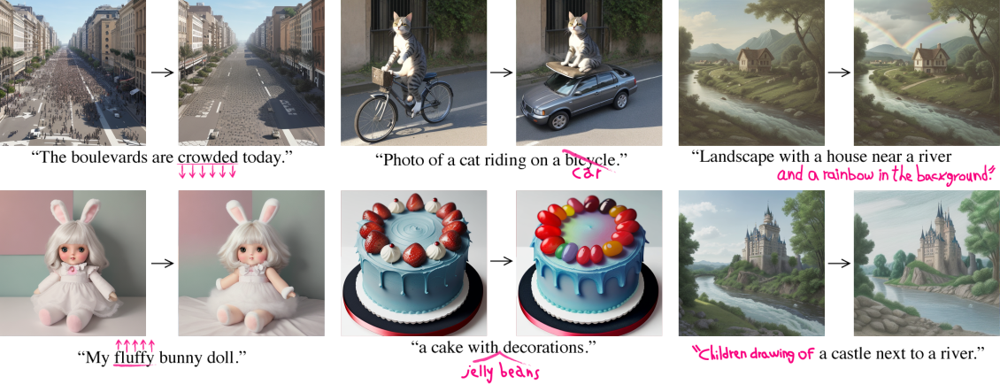

# ComfyUI Port for Google's Prompt-to-Prompt

This is a PoC port of [Google's Prompt-to-Prompt](https://github.com/google/prompt-to-prompt/) to [ComfyUI](https://github.com/comfyanonymous/ComfyUI). It isn't feature complete. But it's good enough for evaluating if prompt-to-prompt is of any good.

All of the images above can be found in the sample_output folder. They can be reproduced by loading them as ComfyUI as workflow.

## Quick Start

0. Clone this repo into the custom_nodes folder of ComfyUI
1. Grab a workflow file from the `workflows/` folder in this repo and load it to ComfyUI
2. Set the model, resolution, seed, sampler, scheduler, etc. Make sure to set KSamplerPromptToPrompt.local_blend_layers to either sd1.5 or sdxl, which has to be correspond to the kind of model you're using.
3. Modify the Prompt 1 and Prompt 2. If the number of words for both prompts are the same, set CLIPTextEncoderPromptToPropmt.mode to `word swap`. If Prompt 2 is longer than Prompt 1, set it to `refinement`. Prompt 2 must not be shorter than Prompt 1. If you wish to use the reweight feature only, set it to `word swap` mode and make the two prompts the same.
4. Run it.
5. Modify KSamplerPromptToPrompt.self_attention_step and KSamplerPromptToPrompt.cross_attention_step and rerun until the amount of modification is just right. Generally, self_attention_step is smaller than cross_attention_step.
6. (optional) To restrict the area of modification (e.g. preserving the background), use the Local Blend feature. See the Local Blend section below. Example workflow: [sample_output/cat_bicycle_modified_withlocalblend.png](sample_output/cat_bicycle_modified_withlocalblend.png)
7. (optional) If the modification isn't strong enough, use the Reweight feature. See the Reweight section below. Example workflows: [sample_output/cake_modified_withreweight.png](sample_output/cake_modified_withreweight.png) and [sample_output/castle_modified_withreweight.png](sample_output/castle_modified_withreweight.png).

## Detailed Usage

This repo can perform the following tasks:

* Word Swap / Prompt Refinement
* Local Blend
* Reweight
* Cross-attention Map Inspection

### Word Swap / Prompt Refinement

Purpose: To perform the modification of the prompt, the two prompts has to be specified. Either Word Swap or Refinement mode can be chosen.

* CLIPTextEncoderPromptToPropmt.text (known as Prompt 1): The original prompt
* CLIPTextEncoderPromptToPropmt.text2 (known as Prompt 2): The edited prompt. If the prompt is meant to stay the same (e.g. for reweighting), fill it with the content identical to Prompt 1.
* CLIPTextEncoderPromptToPropmt.mode:
	* Word swap: Word replacement. The number of words in Prompt 1 must be the same as Prompt 2 due to implementation's limitation. Example: Prompt 1 "cat in a city", Prompt 2 "dog in a city"
	* Refinement: Allows extending concept of Prompt 1. Prompt 2 must have more words than Prompt 1. Example: Prompt 1 "cat in a city", Prompt 2 "cat in a underwater city"
* KSamplerPromptToPrompt.self_attention_step: The step that attn1 (self-attention) replacement starts. That's when the sampler starts using Prompt 2 instead of Prompt 1 for self-attention.
* KSamplerPromptToPrompt.cross_attention_step: Similar to self_attention_step, except that it's for attn2 (cross-attention) replacement. It's also when prompt reweighting starts.

### Local Blend

Purpose: Narrow down the part of the image to be edited. For example, if we want to have Prompt 1 of `cat in a city` and Prompt 2 of `dog in a city`, we would want to limit the change to the cat/dog alone with no change made to the image background. It's empirically found that this feature performs better in SD1.5 than in SDXL. This feature can be disabled by using empty string for `local_blend` and `local_blend2`.

Limitation: Can only specify one phrase per prompt.

* CLIPTextEncoderPromptToPropmt.local_blend / local_blend2: The phrase for generating the mask of `text` / `text2`. If there's multiple matches for the phrase in the `text` / `text2`, only the first match is taken. The mask used is the union of `local_blend` and `local_blend2`. If `local_blend` and `local_blend2` is an empty string, the mask corresponding to the `text` / `text2` would not be generated.
* KSamplerPromptToPrompt.local_blend_layers: The U-Net layers used for generating the mask. Usage of the `LocalBlendLayerPresetPromptToPrompt` node for generating the required string is recommended. SD1.5 and SDXL requires different layers. The exact layer required can be analyzed by using the `KSamplerPromptToPromptAttentionMapLogger` node.
* KSamplerPromptToPrompt.local_blend_threshold: The higher the threshold, the less content the mask would match, and the more focused the editing would be. A sensible value would be between 0.3 and 0.9. Apparently SDXL requires higher local_blend_threshold than SD1.5.

### Reweight

Purpose: Either put more emphasis or less emphasis on the specified phrase. Negative value means removal of concept. This feature can be disabled by using empty string for `reweight_words`. The effect of reweight starts after `cross_attention_step`. To bypass this feature, put empty string to `reweight_words`.

* CLIPTextEncoderPromptToPropmt.reweight_words: The target phrase subjected to weight modification. This phrase is matched against `text2`. If there's multiple matches, only the first match is taken.
* CLIPTextEncoderPromptToPropmt.reweight_value: The amount of emphasis to put into the target phrase. A sensible value is somewhere between -10.0 and 10.0, with lower value means lower emphasis.

### Cross-attention Map Inspection

The node `KSamplerPromptToPromptAttentionMapLogger` can be used as a drop-in replacement of the KSampler node of ComfyUI. Except that this node also output the cross-attention map of each token to the ComfyUI's temporary folder with the following file name: `attn_<out>/<tokenindex>_<type>_<layer>_<index>.png`, where:

* `out` is the output folder name specified in the node
* `tokenindex` is the tokenindex in the prompt (assuming each word takes a token, the 0th token is the start of text token, the 1st is the first word, 2nd is the second word and so on).
* `type`,`layer`,`index` are the U-Net layers. `type` can be `input`, `middle` or `output`. `layer` and `index` are numbers.

The main use of this node is for deriving the value required for `local_blend_layers` for performing local blending. For example, if your prompt is `cat in a city`, since `cat` is the 1st token, you'd want to check `attn_out/1_<type>_<layer>_<index>.png` and look for which images have a clear shape of a cat. After finding all of the images that has a clear cat shape, you write it in the specific space-separated format like `input,7,0 input,8,0 output,3,0 output,4,0 output,5,0` then you feed it to the `local_blend_layers` of the KSamplerPromptToPrompt node.

My very brief empirical test found that SD1.5 has `input,7,0 input,8,0 output,3,0` clearly showing the shape of the object, while SDXL has `input,8,3 middle,0,3`. Therefore, I've made a convenience node LocalBlendLayerPresetPromptToPrompt for generating these two strings.

## Observations and Proposed Future Development Work
			
Based on my own observation, it seems that prompt-to-prompt can mostly be emulated by A1111-like prompt editing feature. I'd recommend using A111-like prompt editing because it takes less VRAM than prompt-to-prompt and it takes less time to render.

The only features that can't be emulated are local blend and negative reweight. If someone's interested in further working on porting prompt-to-prompt, these two are the features that I'd recommend focusing on.

## Limitations

* The code isn't quite production-ready and doesn't cover all edge cases.
* High VRAM requirement. Disabling KSamplerPromptToPrompt.preview can reduce the VRAM usage. On linux, 12GB VRAM is just suffice for SDXL at 1024x1024 with preview disabled
* Word swap only support the same number of words between the two prompts. This is a limitation carried from the Google's published Prompt-to-Prompt repo
* Doesn't work for prompt longer than 77 tokens
* Doesn't work on some sampler like `dpmpp_sde`. I haven't tested every single sampler
* Only one target phrase for each of the Prompt 1 and Prompt 2 in local blend is supported.
* Only one target phrase for reweighting is supported
* The preview looks burnt. I've no clue on how to fix that.

## License

The content inside the `third_party/` folder is licensed under Apache 2.0 License. Those content are adapted from the Google's Prompt-to-Prompt repository.

All other content are licensed under GPL 3.0.
